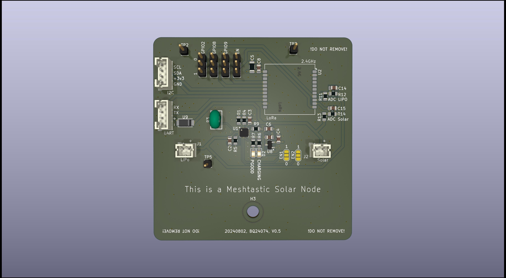
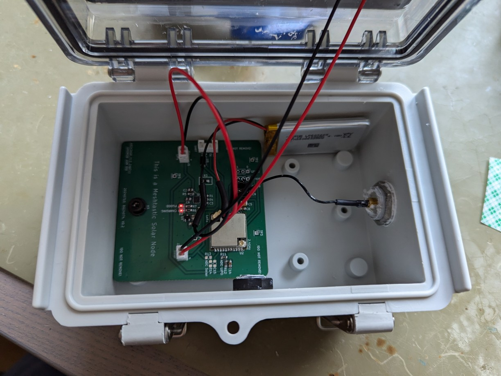

## What is this thing?

This is a Heltec HT-CT62 based Meshtastic Router which can be integrated into a IP68 protected case.

Combined with a solar panel this device can be placed in remote areas to cover a wide range.

For power management a TI BQ24074 is being used which offers pseudo-MPPT and load switching (= battery being deactivated if the sun offers us enough energy to power the device alone).

Voltages can be measured via power divider to GPIO0 (VBUS) or GPIO1 (LiPo)

## But the power consumption of the ESP32 sucks!

Yes and no.

In this setup we don't plan to use BT or Wifi which are famous for their power consumption on this microcontroller.

With the Meshtastic power saving features enabled it will mostly spend its time in light- or even deep-sleep. It automatically wakes up by a pin-triggered interrupt signal.

Even with only a 1000mAh LiPo it will survive for days. Without (!) solar.

I soon will make some power traces with the Nordic Power Analyzer kit.

## Do I have to modify the Software?

Only some smaller pin mapping changes are required. Maybe I'll upstream this in a few weeks.

```
diff --git a/variants/heltec_esp32c3/pins_arduino.h b/variants/heltec_esp32c3/pins_arduino.h
index a717a370..b8ebc09c 100644
--- a/variants/heltec_esp32c3/pins_arduino.h
+++ b/variants/heltec_esp32c3/pins_arduino.h
@@ -6,8 +6,8 @@
 static const uint8_t TX = 21;
 static const uint8_t RX = 20;
 
-static const uint8_t SDA = 1;
-static const uint8_t SCL = 0;
+static const uint8_t SDA = 18;
+static const uint8_t SCL = 19;
 
 static const uint8_t SS = 8;
 static const uint8_t MOSI = 7;
diff --git a/variants/heltec_esp32c3/variant.h b/variants/heltec_esp32c3/variant.h
index 360d9bf1..4f66476d 100644
--- a/variants/heltec_esp32c3/variant.h
+++ b/variants/heltec_esp32c3/variant.h
@@ -1,16 +1,11 @@
-#define BUTTON_PIN 9

-#define LED_PIN 2 // LED
-#define LED_INVERTED 0

 #define HAS_SCREEN 0
 #define HAS_GPS 0
 #undef GPS_RX_PIN
 #undef GPS_TX_PIN
 
+#define BATTERY_PIN 1
+#define ADC_CHANNEL ADC1_GPIO1_CHANNEL
+
 #define USE_SX1262
 #define LORA_SCK 10
 #define LORA_MISO 6
```

### Box


### Cabeling



### Flashing


## Lessons learned

Never ever use hot glue even when if the promise that it's UV resistant. It will fail and then the environment will kill all of your electronics.

Professional glue for construction work and water pools/boat seem to survive every kind of weather as long you keep it within its specs.

Using venting plugs with gore tex membrane.

## Future Changes

The solar charging IC will be replaced with    the new TI BQ25308 which will enable us to utilize solar panels from 4.5-17V without burning a single mA into heat.
